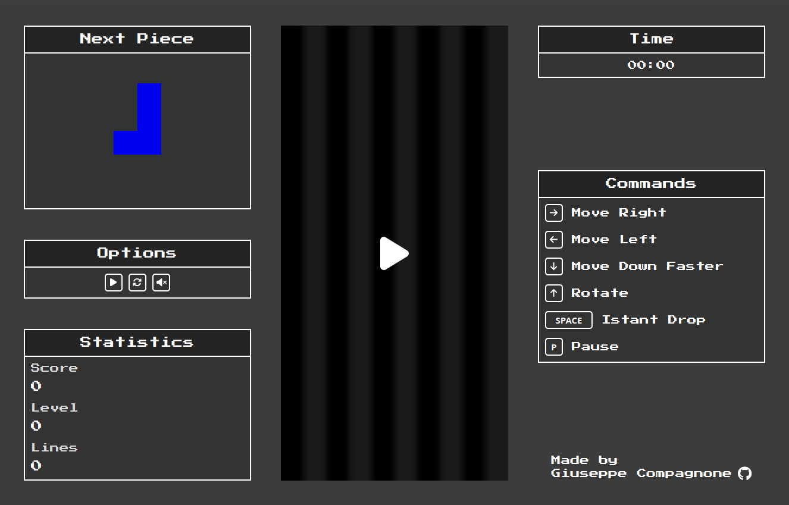
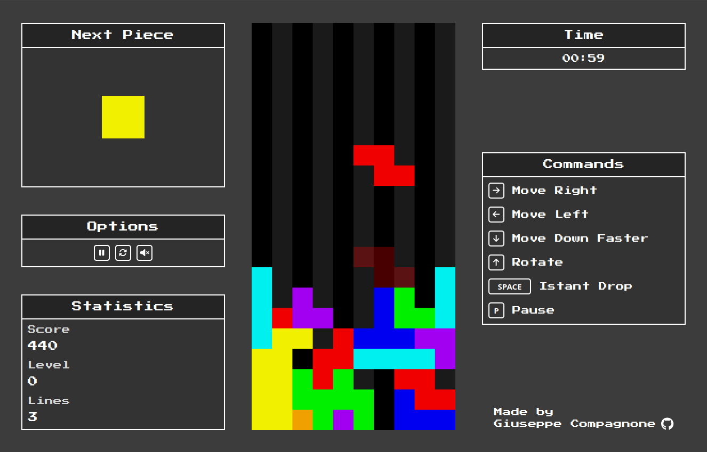
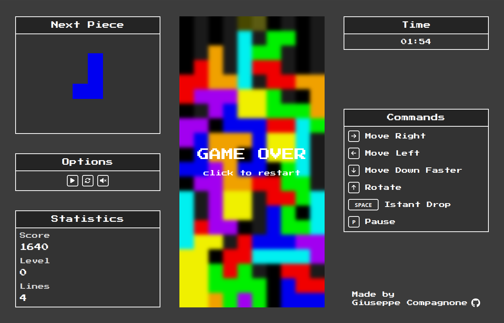

# tetris

# Tetris Game

A fully immersive Tetris game built with **Next.js**, **SCSS**, and **HTML Canvas**.

## 🎮 Features

- **Classic Tetris gameplay** with faithful mechanics
- **Score tracking** to challenge yourself and friends
- **Next piece preview** to plan your moves
- **Ghost piece projection** for better precision
- **Responsive keyboard controls** for a smooth experience
- **Pause and resume function** for uninterrupted play
- **Original Tetris music** for a nostalgic touch

## 🚀 Tech Stack

- **Next.js** – For game logic and rendering
- **SCSS** – For a modern and clean interface design
- **HTML Canvas** – For rendering the grid and pieces

## 🎮 Controls

- **← (Left Arrow)** – Move the piece left
- **→ (Right Arrow)** – Move the piece right
- **↓ (Down Arrow)** – Speed up the piece's descent
- **↑ (Up Arrow)** – Rotate the piece
- **Spacebar** – Instantly drop the piece
- **P** – Pause/Resume the game

## 📷 Screenshot

